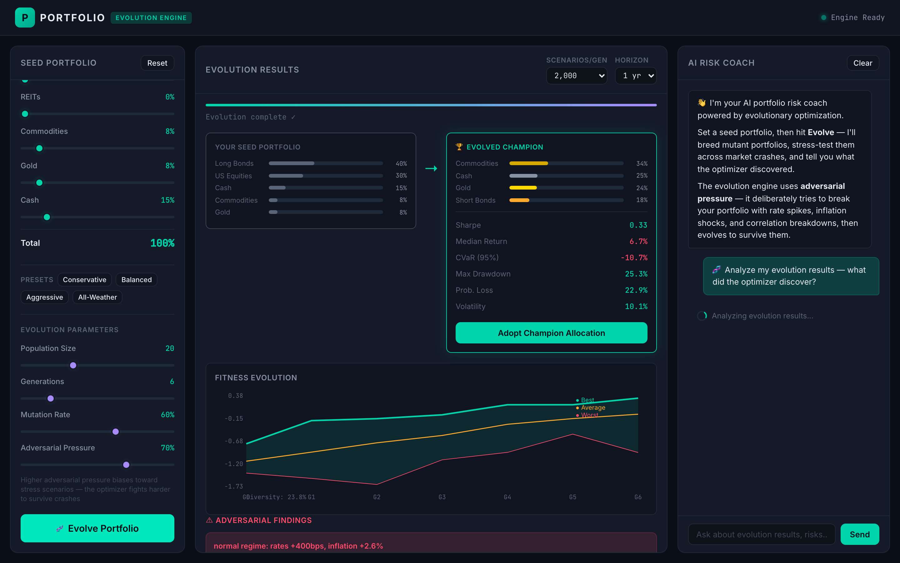

# 🧬 Portfolio Evolution Engine

**Genetic portfolio optimizer with adversarial stress testing.**

Most AI tools just *chat* about portfolio risk. This one actually *simulates* it — breeding, mutating, and stress-testing thousands of portfolio variants across market crashes to find allocations that survive.




## The Problem

A LinkedIn user tried using Google Gemini to build a diversified portfolio. Gemini suggested equities + 20-year bonds. The user had to *manually* point out that rising interest rates would crash **both** stocks and bonds simultaneously — exactly what happened in 2022 ([Callan research](https://www.callan.com/blog/stock-and-bond-declines/)). Gemini just agreed and said "you're right."

**The conclusion: AI chatbots can't "think" or simulate scenarios. They just have conversations with themselves.**

This app fixes that.

## What It Does

Instead of chatting about risk, this engine:

1. **Breeds** your portfolio into 20+ mutant variants (point mutations, crossover breeding, regime-aware hedging shifts, random immigrants for diversity)
2. **Stress-tests** each variant across thousands of Monte Carlo scenarios in 4 market regimes:
   - 📈 **Normal** — typical stock/bond negative correlation
   - 🔥 **2022-style crash** — rates spike, inflation high, stocks AND bonds crash together
   - 💀 **Stagflation** — high inflation with low growth, most assets struggle
   - 📉 **Deflationary spiral** — growth collapses, risk assets crash hard
3. **Selects survivors** based on risk-adjusted fitness (Sharpe ratio, CVaR, max drawdown, returns)
4. **Repeats** over multiple generations — portfolios evolve to survive scenarios you never thought to test
5. **AI explains** what the optimizer discovered and why (optional, requires API key)

### Key Feature: Adversarial Pressure

The adversarial pressure slider biases the simulation toward stress scenarios. Crank it up and the engine deliberately tries to **break** your portfolio with rate spikes, correlation breakdowns, and stagflation — then evolves allocations that survive them.

When tested with a standard balanced portfolio, the engine independently discovered the same insight from the LinkedIn post — it **cut long-duration bonds, reduced equities, and boosted TIPS, gold, and commodities** as inflation hedges that don't share the rate-sensitivity problem.

## Quick Start

### 1. Install Bun

Bun is a fast JavaScript runtime. Install it with one command:

**Mac / Linux:**
```bash
curl -fsSL https://bun.sh/install | bash
```

**Windows (PowerShell):**
```powershell
irm bun.sh/install.ps1 | iex
```

After installing, **close and reopen your terminal** so the `bun` command is available.

### 2. Download & Install

```bash
git clone https://github.com/HelgeSverre/portfolio-evolution-engine.git
cd portfolio-evolution-engine
bun install
```

### 3. Start the App

```bash
bun start
```

Open **http://localhost:3000** in your browser. That's it — the evolution engine and simulations work immediately with no configuration.

### 4. (Optional) Enable AI Analysis

The AI Risk Coach uses Claude to explain what the optimizer discovered. To enable it:

1. Go to [console.anthropic.com](https://console.anthropic.com) and create an account
2. Generate an API key
3. Create a file called `.env` in the project folder with this content:

```
ANTHROPIC_API_KEY=sk-ant-your-key-here
```

4. Restart the server (`Ctrl+C`, then `bun start` again)

> **Without an API key**, the evolution engine, Monte Carlo simulations, adversarial stress testing, and all visualizations work fully. You just won't get the AI-powered natural language analysis.

## How to Use

### 1. Set Your Seed Portfolio

Use the sliders on the left to set your starting allocation, or click a preset:

| Preset | Description |
|--------|-------------|
| **Conservative** | Heavy short bonds + TIPS, low equity |
| **Balanced** | Classic 60/40-ish with inflation hedges |
| **Aggressive** | High equity, minimal bonds |
| **All-Weather** | Ray Dalio-inspired: 30% stocks, 40% long bonds, 15% gold/commodities |

The total must equal 100%.

### 2. Tune the Evolution

| Parameter | What it does |
|-----------|-------------|
| **Population Size** | How many portfolio variants per generation (more = slower but more thorough) |
| **Generations** | How many rounds of breeding/selection (more = better optimization) |
| **Mutation Rate** | How aggressively to mutate allocations (higher = more exploration) |
| **Adversarial Pressure** | How much to bias toward crash scenarios (higher = tougher survival test) |

### 3. Hit "Evolve Portfolio"

The engine will breed, mutate, and stress-test your portfolio over multiple generations. You'll see:

- **Before/After comparison** — your seed vs. the evolved champion
- **Fitness curve** — how the population improved over generations
- **Adversarial findings** — specific scenarios that break portfolios (correlation breakdowns, rate spikes, stagflation traps)
- **Hall of Fame** — top 5 unique strategies discovered
- **AI analysis** — what the optimizer discovered and remaining risks (requires API key)

### 4. Adopt & Iterate

Click **"Adopt Champion Allocation"** to load the evolved portfolio as your new seed, tweak it, and evolve again.

## Architecture

```
src/
  server.ts              → Bun HTTP server (API + static files)
  domain/
    types.ts             → Core types (Portfolio, AssetClass, SimulationSummary)
    simulation.ts        → Monte Carlo engine (factor model, regime-aware)
    scenarios.ts         → Macro shock generator (4 regimes, tail-event mutations)
    evolution.ts         → Genetic algorithm (breed, mutate, crossover, select)
  infra/
    anthropic.ts         → Claude AI integration (optional)
    rng.ts               → Seeded PRNG (reproducible simulations)
    stats.ts             → Cholesky decomposition, correlation, percentiles
data/
  assumptions.json       → Asset class betas, volatilities, regime definitions
public/
  index.html             → Single-page app
  styles.css             → Dark fintech theme
  app.js                 → Frontend (portfolio builder, charts, chat)
```

## How the Simulation Works

Each asset class has sensitivities (betas) to 4 macro factors: **interest rates, inflation, growth, and risk-off sentiment**. Each scenario:

1. Samples a market regime (normal, 2022-crash, stagflation, deflation)
2. Generates correlated macro shocks via the factor model
3. Applies regime-specific correlation overrides (e.g., in 2022-mode, stock/bond correlation flips positive)
4. Adds tail-event mutations (5% chance of a 200-400bps rate jump)
5. Computes per-asset returns and aggregates by portfolio weights

The genetic algorithm then uses **tournament selection**, **uniform/blend crossover**, and **5 mutation types** (point, Gaussian, swap, zero-out, regime-aware hedging) to evolve portfolios that maximize a fitness function combining Sharpe ratio, CVaR, max drawdown, and mean returns.

## License

MIT

---

*Inspired by [this LinkedIn post](https://www.linkedin.com/posts/activity-7331625221697093632) about the limitations of AI chatbots for portfolio construction, and [Callan's research](https://www.callan.com/blog/stock-and-bond-declines/) on simultaneous stock and bond declines.*

*Built with [Bun](https://bun.sh) and [Claude](https://anthropic.com).*
